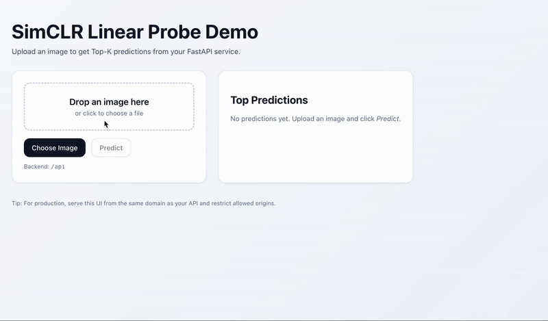

# SimCLR Inference 

## Overview

**SimCLR Inference** is an end-to-end image classification service that wraps a SimCLR encoder + linear probe behind a simple web API and SPA frontend.



- **What it does:** Given an input image, the service returns the **top-K predicted classes** with confidence scores.
- **Why it’s fast/lightweight:** The primary path uses a **quantized TFLite** model to reduce memory footprint and latency, making it suitable for small VMs and edge deployments. A legacy path (`app_v1.py`) also supports the original **TensorFlow SavedModel + .h5** linear head for comparison.
- **Backend:** **FastAPI** (Uvicorn). Endpoints include `/health`, `/perf` (rolling latency + memory), and `/predict` (multipart upload: `file`). Thread counts are pinned to keep CPU usage predictable on small instances.
- **Frontend:** **Vite** app served by **Nginx**. A minimal UI lets you upload an image and view predictions. Nginx **proxies** `/api/*` → `backend:8000`, so the browser and API share the same origin (no public port 8000, no CORS headaches).
- **Packaging & Deploy:** **Docker Compose** brings up both services with one command. Designed to run locally (localhost:80/8000) or on **EC2** (port 80/443 public; backend hidden behind the proxy). Large model artifacts are intentionally **.gitignored** to keep the repo lean; use LFS or external storage if needed.
- **Extensible:** Swap class lists (`class_names.txt`), replace the quantized model (`model_dynamic.tflite`), or point the legacy app to a different SavedModel directory without changing the API.

## Contents

- **`app.py`** — FastAPI app for **quantized inference** (primary).
- **`app_v1.py`** — Older FastAPI app supporting **both** naive TF and quantized TFLite inference.
- **`export_tflite.py`** — Script to **export / quantize** a TensorFlow model to **TFLite**.
- **`class_names.txt`** — Line-separated class labels.
- **`saved_model/`** — TensorFlow SavedModel directory This folder is **not** in this repo. You can access it here: "gs://simclr-checkpoints-tf2/simclrv2/finetuned_100pct/r50_1x_sk0/saved_model/" and put it in folder saved_model so that is ha `saved_model/saved_model.pb`, `saved_model/variables/variables.index`, `saved_model/variables/variables.data-00000-of-00001`
- **`best_linear_probe3.weights.h5`** — Linear head weights.
- **`model_dynamic.tflite`** — Quantized model produced by `export_tflite.py`.
- **`Dockerfile.backend` / `docker-compose.yaml`** — Containerization (FastAPI + optional Nginx frontend).

---

## Running Docker Compose

```bash
# Build & start backend (and frontend if present)
docker compose up -d --build

# Check health from the instance or your machine (depending on exposure):
curl http://localhost:8000/health
```

## Front End access

- **Local (Docker Compose on your machine):**  
  Open: **http://localhost/**

- **EC2 / Remote host (proxy setup recommended):**  
  Open: **http://<EC2_PUBLIC_IP>/**  
  API is proxied at **/api** → `backend:8000` inside Docker.  
  Health check via proxy: `http://<EC2_PUBLIC_IP>/api/health`

### How the frontend talks to the backend
- If using the **proxy** : build the frontend with
  ```yaml
  args:
    VITE_BACKEND_URL: /api

